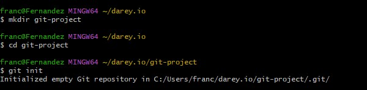
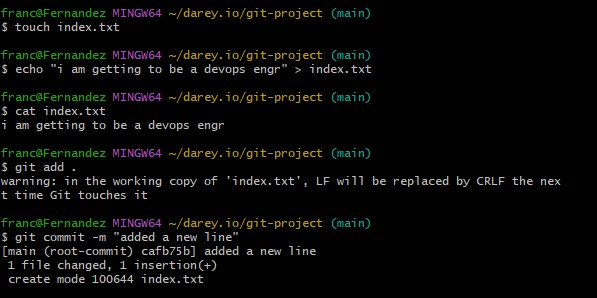
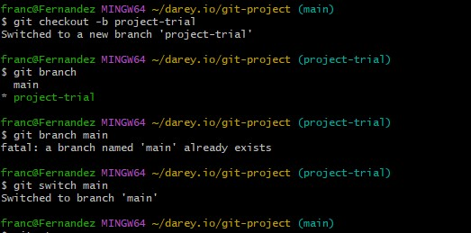
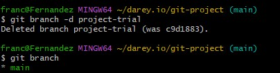
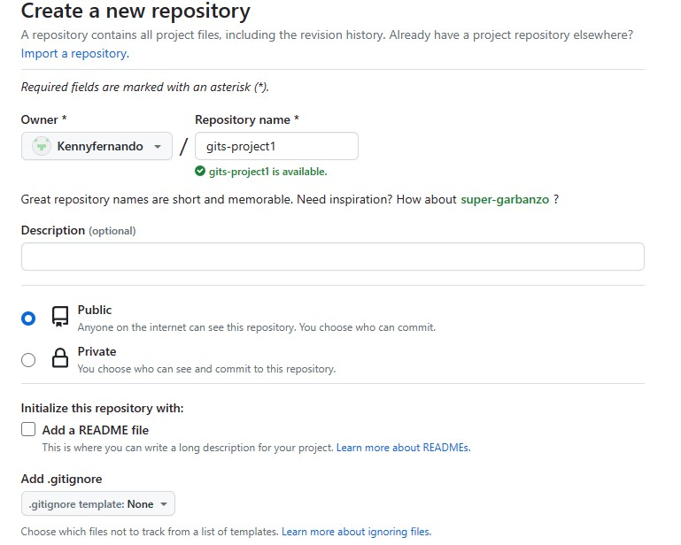
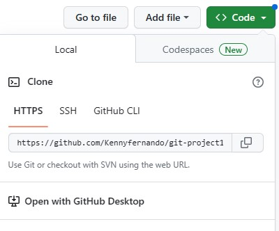
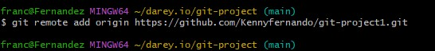
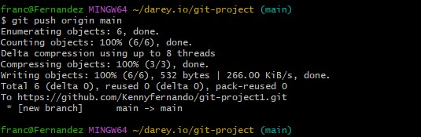
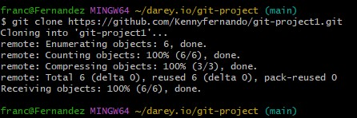

 ## Initiializing Git Repository
 **first step for git** Make sure you have installed gitbash or have any command command line tool. You create a folder and navigate into the folder then you can run the 'git init' to initialize git in your local computer
 
 

## Making My First Commit
Commit is more or less saving the changes you made to your files. Making a commiit takes a snapshot of the current state of your repository and saves a copy in the .git folder inside your working directory.

### Git Branching
Git branching helps to create a different copy(page) of your source code. It helps give team work with developers were they build there codes in a branch for testing and then merge the code into one branch

# Listing your git branch

## Merging a Branch into another Branch

## Deleting a Branch

### Collaboration and Remote Repositories
*Git* is a version control system that is used to solve problems like sharing source code and tracking changes to source code. Using git for collaboration is usually done among teams remotely. To make this happen we have to introduce github.[Github](https://www.github.com)
github is a web based platform where git repositories are hosted. By hosting our local git repository on github, it becomes available in the public internet(it is posssible to create a private address too). Remote teams or anyone can now view, update and make changes to the same repository.
first you can create an account on github

### Pushing your git Repository to your Remote github Repository.
You copy your repository link from your github and go to your gitbash command line and run the git remote add command with the link. 

After you have commited your changes to the local repo, you push the content to the remote repo using the command below
N//B The word origin refers to your remote repo link, it can be any word you choose.

### Cloning Remote Git Repository 
After adding a remote git repository and pushed your local repository to it. You can have your team have access to it and make changes to the code and create new branch.
Git clone command helps us make a copy of remote repository in our local machine. See it as a git tool for downloading remote repository into our local machine.

